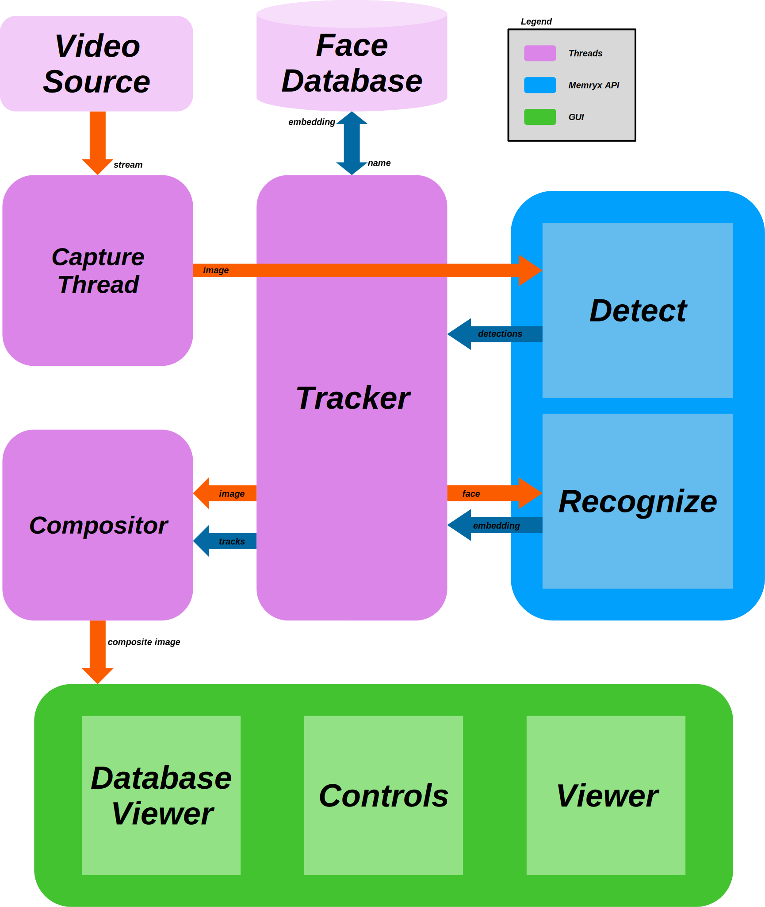

# Realtime Face Recognition 

Realtime face recognition enabled by the MemryX MX3. 

<p align="center">
  
</p>

## Overview

| Property             | Details                                                                 
|----------------------|-------------------------------------------------------------------------
| **Model**            | [YoloV8n-Face](https://github.com/derronqi/yolov8-face), [FaceNet](https://arxiv.org/pdf/1503.03832)
| **Model Type**       | Face Detection + Recognition
| **Framework**        | [Onnx](https://onnx.ai/) + [Keras](https://keras.io/)
| **Model Source**     | [YoloV8n-Face](https://github.com/derronqi/yolov8-face), [FaceNet](https://github.com/serengil/deepface/blob/master/deepface/models/facial_recognition/Facenet.py)
| **Pre-compiled DFP** | [Download here](https://developer.memryx.com/example_files/face_recognition.zip)                                           
| **Output**           | Face bounding box + keypoints + embedding
| **OS**               | Linux
| **License**          | [GPL](LICENSE.md)                                         

## Setup and Installation

```bash
git clone https://github.com/memryx/FaceRecognitionDemo.git
cd FaceRecognitionDemo
pip3 install --extra-index-url https://developer.memryx.com/pip -r requirements.txt
```

Download the memryx `.dfp` for face detection and recognition.
```bash
wget https://developer.memryx.com/example_files/face_recognition.zip
unzip face_recognition.zip -d assets/models/
rm face_recognition.zip
```

## Running

Running the applicaiton is as easy as:

```bash
python3 demo.py
```

## Features


## Software Architecture

Below is a high-level diagram for the software architecture.
<p align="center">
  
</p>

## Licenses

This project uses third-party software, models, and libraries. Below are the details of the licenses for these dependencies:

- **Models**: [Yolov8n-face Model exported from Yolov8-Face Github Repository](https://github.com/derronqi/yolov8-face) 🔗  
  - License: [GNU General Public License v3.0](https://github.com/derronqi/yolov8-face/blob/main/LICENSE) 🔗
- **Models**: [FaceNet Model exported from the DeepFace Github Repository](https://github.com/serengil/deepface) 🔗  
  - License: [MIT License](https://github.com/serengil/deepface/blob/master/LICENSE) 🔗
